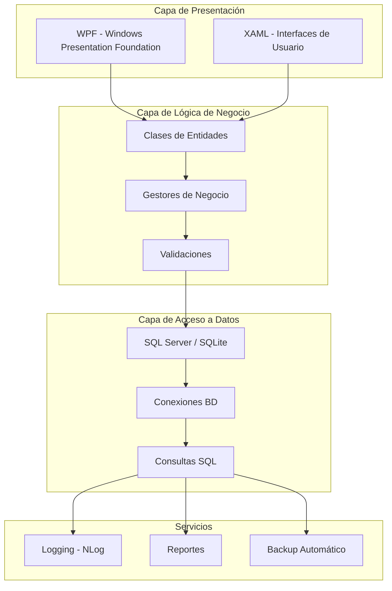

# Agropecuaria - Sistema de Gestión Empresarial


## Tabla de Contenidos

- [Descripción General](#descripción-general)
- [Características Principales](#características-principales)
- [Arquitectura del Sistema](#arquitectura-del-sistema)
- [Requisitos del Sistema](#requisitos-del-sistema)
- [Instalación y Configuración](#instalación-y-configuración)
- [Uso del Sistema](#uso-del-sistema)
- [Estructura de la Base de Datos](#estructura-de-la-base-de-datos)
- [Módulos y Funcionalidades](#módulos-y-funcionalidades)
- [Seguridad y Permisos](#seguridad-y-permisos)
- [Tecnologías Utilizadas](#tecnologías-utilizadas)
- [Documentación Técnica](#documentación-técnica)
- [Solución de Problemas](#solución-de-problemas)
- [Equipo de Desarrollo](#equipo-de-desarrollo)
- [Licencia](#licencia)

## 🎯 Descripción General

**Agropecuaria** es un sistema integral de gestión empresarial diseñado específicamente para empresas del sector agropecuario. Desarrollado con tecnologías modernas de Microsoft (.NET 8.0 y WPF), este sistema proporciona una solución completa para la administración de inventarios, clientes, proveedores, facturación y finanzas.

El sistema ofrece una interfaz intuitiva y moderna que permite a los usuarios gestionar eficientemente todas las operaciones comerciales de la empresa, desde el control de inventario hasta la gestión financiera completa.

## ✨ Características Principales

### 📦 Gestión de Inventario

- Control completo de productos y existencias
- Gestión de lotes y fechas de vencimiento
- Alertas automáticas de inventario mínimo
- Múltiples precios de venta (detal, mayor, especial)
- Gestión de grupos y categorías de productos

### 👥 Gestión de Clientes y Proveedores

- Base de datos completa de clientes con información detallada
- Gestión de proveedores y relaciones comerciales
- Control de deudas y pagos
- Historial de transacciones completo

### 📄 Facturación y Ventas

- Sistema de facturación integrado
- Múltiples tipos de facturas (clientes y proveedores)
- Impresión de facturas profesionales
- Control de devoluciones y notas de crédito

### 💰 Gestión Financiera

- Control de ingresos y gastos
- Gestión de inversiones
- Reportes financieros detallados
- Análisis de rentabilidad

### 🔐 Seguridad y Control de Acceso

- Sistema de autenticación segura
- Control de permisos por usuario
- Registro de actividades (logging)
- Respaldos automáticos de base de datos

## 🏗️ Arquitectura del Sistema



## 💻 Requisitos del Sistema

### Requisitos Mínimos

- **Sistema Operativo**: Windows 7 o superior
- **Framework**: .NET 8.0 o superior
- **Memoria RAM**: 4 GB mínimo (8 GB recomendado)
- **Espacio en Disco**: 500 MB disponibles
- **Resolución de Pantalla**: 1280x720 píxeles

### Requisitos de Software

- Microsoft .NET 8.0 Runtime
- Base de datos SQLite o SQL Server
- Visual Studio 2022 (para desarrollo)

## 🚀 Instalación y Configuración

### Paso 1: Clonar el Repositorio

```bash
git clone https://github.com/tu-usuario/agropecuaria.git
cd agropecuaria
```

### Paso 2: Instalar Dependencias

```bash
# Instalar .NET 8.0 SDK
# Descargar desde: https://dotnet.microsoft.com/download/dotnet/8.0

# Restaurar paquetes NuGet
dotnet restore
```

### Paso 3: Configurar Base de Datos

```bash
# La base de datos SQLite se creará automáticamente en la primera ejecución
# Para SQL Server, configurar la cadena de conexión en appsettings.json
```

### Paso 4: Compilar y Ejecutar

```bash
# Compilar el proyecto
dotnet build

# Ejecutar la aplicación
dotnet run
```

## 📊 Uso del Sistema

### 📝 Gestión de Productos

1. Acceder al módulo de **Inventario**
2. Presionar el botón **"+"** para agregar nuevo producto
3. Completar los campos requeridos:
   - Nombre del producto
   - Cantidad inicial
   - Precios de venta (detal, mayor, especial)
   - Cantidad mínima de inventario
4. Guardar el registro

### 💳 Facturación

1. Ir al módulo de **Transacción**
2. Seleccionar cliente o proveedor
3. Agregar productos al carrito
4. Aplicar descuentos si corresponde
5. Generar e imprimir la factura

### 📈 Reportes

1. Acceder al módulo de **Informes**
2. Seleccionar el tipo de reporte deseado
3. Configurar filtros de fecha y otros parámetros
4. Generar y exportar el reporte

## 🗄️ Estructura de la Base de Datos

### Tablas Principales

#### Tabla: Usuarios

```sql
CREATE TABLE Usuario (
    usuario VARCHAR(50) PRIMARY KEY,
    contraseña VARCHAR(50) NOT NULL,
    Mostrar BOOLEAN DEFAULT 1
);
```

#### Tabla: Productos

```sql
CREATE TABLE Producto (
    id INTEGER PRIMARY KEY AUTOINCREMENT,
    Nombre VARCHAR(100) NOT NULL,
    cantidad_total_actual REAL DEFAULT 0,
    cantidad_minima INTEGER DEFAULT 0,
    precio_costo REAL DEFAULT 0,
    precio_venta_detal REAL DEFAULT 0,
    precio_venta_mayor REAL DEFAULT 0,
    precio_venta_especial REAL DEFAULT 0,
    grupo INTEGER
);
```

#### Tabla: Clientes

```sql
CREATE TABLE Clientes (
    Cedula VARCHAR(20) PRIMARY KEY,
    Nombre VARCHAR(100) NOT NULL,
    telefono VARCHAR(20),
    ubicacion VARCHAR(200)
);
```

## 🔧 Módulos y Funcionalidades

### 1. 📊 Dashboard Principal

- Vista general del negocio
- Estadísticas en tiempo real
- Gráficos de ventas e inventario
- Alertas de importancia

### 2. 📦 Inventario

- Gestión de productos
- Control de existencias
- Gestión de lotes
- Reportes de inventario

### 3. 👥 Clientes

- Registro de clientes
- Gestión de deudas
- Historial de compras
- Estadísticas de clientes

### 4. 🏪 Proveedores

- Catálogo de proveedores
- Gestión de compras
- Control de pagos
- Evaluación de proveedores

### 5. 💰 Finanzas

- Control de ingresos
- Gestión de gastos
- Administración de inversiones
- Reportes financieros

### 6. 🖨️ Facturación

- Generación de facturas
- Control de devoluciones
- Notas de crédito
- Impresión de documentos

### 7. ⚙️ Configuración

- Gestión de usuarios
- Configuración del negocio
- Respaldos de seguridad
- Personalización del sistema

## 🔐 Seguridad y Permisos

### Sistema de Permisos por Rol

El sistema implementa un complejo sistema de permisos basado en roles:

```csharp
public const string Permiso_Inventario = "Inventario";
public const string Permiso_Crear_Producto = "Crear Producto";
public const string Permiso_Editar_Producto = "Editar Producto";
public const string Permiso_Crear_Facturas = "Crear Facturas";
public const string Permiso_Ver_Reportes = "Ver Reportes";
```

### Características de Seguridad

- **Autenticación segura**: Login con contraseña encriptada
- **Control de acceso**: Permisos granulares por usuario
- **Logs de auditoría**: Registro completo de actividades
- **Respaldo automático**: Copias de seguridad programadas
- **Sesiones seguras**: Timeout automático de sesiones

## 🛠️ Tecnologías Utilizadas

### Framework y Lenguajes

- **.NET 8.0**: Framework principal
- **C#**: Lenguaje de programación
- **WPF**: Windows Presentation Foundation para la interfaz
- **XAML**: Lenguaje de marcado para interfaces

### Base de Datos

- **SQLite**: Base de datos ligera y portable
- **SQL Server**: Base de datos empresarial (opcional)
- **ADO.NET**: Acceso a datos

### Librerías y Herramientas

- **NLog**: Sistema de logging
- **LoremNET**: Generación de datos de prueba
- **System.Data.SqlClient**: Conectividad SQL Server
- **System.Data.SQLite**: Conectividad SQLite

## 📚 Documentación Técnica

### Arquitectura de Clases

El sistema sigue un diseño orientado a objetos con las siguientes clases principales:

```csharp
// Ejemplo de estructura de clase
public class Producto
{
    public int ID { get; set; }
    public string Nombre { get; set; }
    public float Cantidad_Total_actual { get; set; }
    // ... más propiedades
}
```

### Patrones de Diseño

- **MVC (Model-View-Controller)**: Separación de responsabilidades
- **Repository Pattern**: Abstracción del acceso a datos
- **Singleton**: Gestión de configuraciones globales

## 🐛 Solución de Problemas

### Problemas Comunes

#### Error de Conexión a Base de Datos

```bash
# Verificar que el archivo de base de datos exista
# Verificar permisos de escritura en el directorio
# Verificar cadena de conexión en configuración
```

#### Error de Permisos

```bash
# Asegurarse de que el usuario tenga los permisos necesarios
# Verificar configuración de permisos en base de datos
# Reiniciar la aplicación después de cambiar permisos
```

#### Problemas de Impresión

```bash
# Verificar impresoras instaladas
# Verificar permisos de impresión
# Reiniciar servicio de impresión de Windows
```
