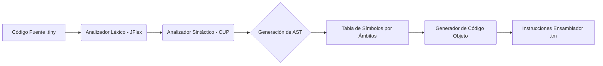

# 🚀 TINY Compiler: De Alto Nivel a Código Objeto (TM)

Este proyecto consiste en un **compilador completo** para el lenguaje **TINY**, desarrollado en Java utilizando **JFlex** (análisis léxico) y **JavaCUP** (análisis sintáctico). El sistema es capaz de transformar código de alto nivel en instrucciones de ensamblador para la **Tiny Machine (TM)**, una arquitectura virtual basada en registros.

Originalmente basado en un núcleo académico, este compilador fue **extendido y optimizado en un sprint intensivo pocos días**, transformando un intérprete básico en un lenguaje procedimental con soporte para funciones, ámbitos y estructuras de datos complejas.


## 🎯 Características Destacadas

### 1. Gestión de Ámbitos (Scoping) y Tabla de Símbolos

Se implementó una arquitectura de **pila de tablas de símbolos (Stack of HashMaps)** para gestionar la visibilidad de variables.

* **Soporte Multi-ámbito:** Diferenciación entre variables globales y locales.
* **Gestión de Contextos:** El compilador maneja automáticamente la entrada y salida de ámbitos al procesar funciones.

### 2. Soporte Procedimental (Funciones)

Evolución del lenguaje para permitir programación modular:

* **Declaración y Llamada:** Soporte para subrutinas con pasaje de parámetros.
* **Gestión de Retorno:** Implementación de la sentencia `return` y manejo de valores de retorno en registros.
* **Stack Frames:** Simulación de marcos de pila para evitar colisiones en memoria durante llamadas recursivas o anidadas.

### 3. Estructuras de Datos (Arreglos)

Añadida la capacidad de manejar vectores:

* Declaración dinámica de tamaño.
* Acceso y asignación mediante índices calculados en tiempo de ejecución.
* Validación semántica para prevenir el uso de índices negativos (en casos constantes).

### 4. Optimización de Gramática (Syntactic Sugar)

Se implementó una técnica de **"AST Lowering"** (Descomposición Sintáctica) para el ciclo `for`.

* El compilador no genera código ensamblador complejo para el `for`. En su lugar, **re-escribe el Árbol de Sintaxis Abstracta (AST)** transformando el `for` en una combinación lógica de `asignación + if + repeat`, asegurando un binario final más limpio y eficiente.

---

## 🏗️ Arquitectura del Compilador



---

## 🛠️ Stack Tecnológico

* **Lenguaje:** Java 8+
* **Analizador Léxico:** JFlex
* **Generador de Parsers:** JavaCUP (LALR)
* **Arquitectura Objetivo:** Tiny Machine (Virtual Register-Based Machine)

---

## 🚀 Ejecución y Compilación

El proyecto incluye un script de automatización en PowerShell (`Analist.ps1`) para regenerar los analizadores:

1. **Generar Analizadores:**

    ```powershell
    ./Analist.ps1
    ```

2. **Compilar y Ejecutar:**

    ```bash
    javac -cp "lib/java-cup-11b.jar;src/" src/App.java
    java -cp "lib/java-cup-11b.jar;src/" App ejemplo.tiny
    ```

---

## 📝 Ejemplo de Código Soportado

```tiny
fun sumar(a, b)
    return a + b;
endf

var lista[5];
i := 0;

if i <= 5 then
    repeat
        read lista[i];
        i := i + 1
    until i >= 5;
end

write sumar(lista[0], 10);
```

---

## 💡 Reflexión Técnica

Este proyecto representó un reto de ingeniería significativo, especialmente al implementar la **recursividad de funciones** y la **gestión de memoria relativa** para los arreglos dentro de una arquitectura limitada. La capacidad de ordenar el "caos" inicial y extender la gramática en un plazo de 7 días demuestra un dominio sólido de la teoría de lenguajes y estructuras de datos complejas.

---
**Desarrollado por:** Jose Gregorio Briceño Romero  
*Ingeniería Informática - Universidad Nacional Experimental del Táchira (UNET)*
