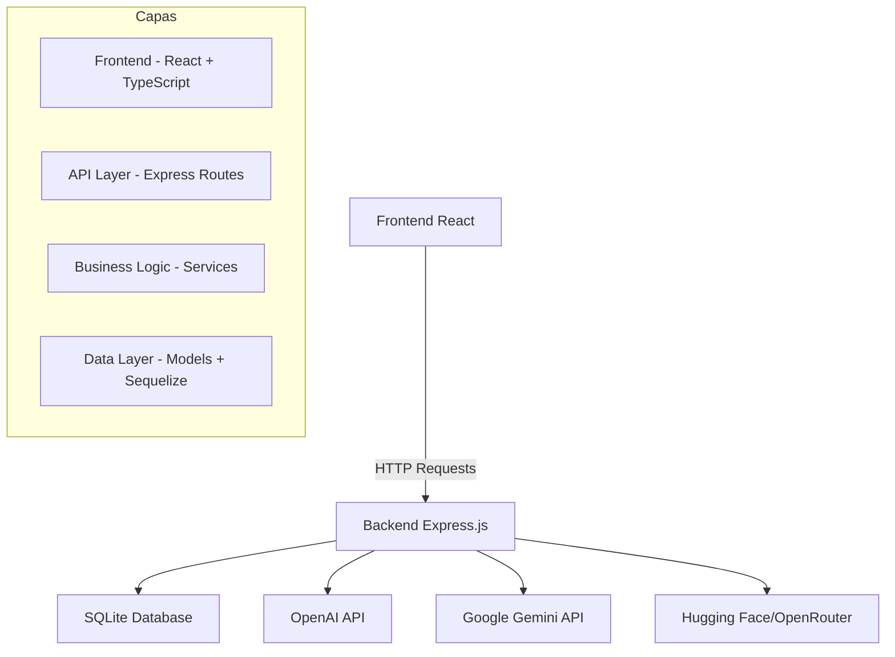

# 🚀 ChatGPT Clone - Aplicación de Chat con IA

Una aplicación de chat moderna que integra múltiples servicios de inteligencia artificial (OpenAI, Google Gemini, y servicios de Hugging Face/OpenRouter) con una interfaz de usuario intuitiva y gestión completa de conversaciones.

<div align="center">
  
  
  
  
  
  
</div>

## 📋 Índice

- [🌟 Características](#-características)
- [🛠️ Tecnologías Utilizadas](#️-tecnologías-utilizadas)
- [🏗️ Arquitectura](#️-arquitectura)
- [📦 Instalación](#-instalación)
- [⚙️ Configuración](#️-configuración)
- [🚀 Uso](#-uso)
- [📡 API Endpoints](#-api-endpoints)
- [📁 Estructura del Proyecto](#-estructura-del-proyecto)
- [🔧 Desarrollo](#-desarrollo)
- [📝 Notas](#-notas)

## 🌟 Características

### ✅ Funcionalidades Principales

- **Multi-LMS Support**: Integración con OpenAI, Google Gemini, Hugging Face y OpenRouter
- **Gestión de Conversaciones**: Crear, listar y gestionar múltiples chats por usuario
- **Autenticación de Usuarios**: Sistema completo de registro y login
- **Interfaz Responsiva**: Diseño moderno con Material-UI
- **Persistencia de Datos**: SQLite con Sequelize ORM
- **Tokens API**: Soporte para múltiples claves API

### 💬 Capacidades del Chat

- Conversaciones en tiempo real con múltiples modelos de IA
- Historial de mensajes persistente
- Gestión de múltiples conversaciones simultáneas
- Configuración personalizada de parámetros del modelo
- Soporte para instrucciones del sistema

## 🛠️ Tecnologías Utilizadas

### Backend

- **Node.js** con **TypeScript**
- **Express.js** - Framework web
- **Sequelize** - ORM para base de datos
- **SQLite** - Base de datos
- **CORS** - Manejo de CORS
- **dotenv** - Variables de entorno

### Frontend

- **React 19** con **TypeScript**
- **Vite** - Build tool
- **React Router** - Navegación
- **Axios** - Cliente HTTP
- **Material-UI** - Componentes UI
- **Emotion** - Estilos CSS

### Servicios de IA

- **OpenAI API**
- **Google Generative AI**
- **Hugging Face**
- **OpenRouter**

## 🏗️ Arquitectura



## 📦 Instalación

### Requisitos Previos

- Node.js >= 18.0.0
- npm >= 9.0.0

### Paso 1: Clonar el Repositorio

```bash
git clone https://github.com/tu-usuario/chatgpt-clone.git
cd chatgpt-clone
```

### Paso 2: Instalar Dependencias del Backend

```bash
cd Backend
npm install
```

### Paso 3: Instalar Dependencias del Frontend

```bash
cd ../frontend
npm install
```

## ⚙️ Configuración

### Variables de Entorno (Backend)

Crea un archivo `.env` en el directorio `Backend`:

```env
PORT=3001
OPENAI_API_KEY=tu_clave_openai
GEMINI_API_KEY=tu_clave_gemini
```

### Variables de Entorno (Frontend)

Crea un archivo `.env` en el directorio `frontend`:

```env
VITE_API_URL=http://localhost:3001
VITE_COLAB_URL=tu_url_colab # Opcional para servicios colab
```

### Inicializar la Base de Datos

El proyecto se sincroniza automáticamente con SQLite. Los modelos por defecto se insertan automáticamente al iniciar.

## 🚀 Uso

### Desarrollo Local

1. Iniciar el servidor backend:

```bash
cd Backend
npm run dev
```

1. Iniciar la aplicación frontend (en otra terminal):

```bash
cd frontend
npm run dev
```

1. Abrir el navegador en `http://localhost:5173`

### Producción

1. Construir el frontend:

```bash
cd frontend
npm run build
```

1. Construir el backend:

```bash
cd Backend
npm run build
```

1. Iniciar el servidor:

```bash
cd Backend
npm start
```

## 📡 API Endpoints

### Autenticación

- `POST /api/user/login` - Iniciar sesión
- `POST /api/user/register` - Registrar usuario

### Chat

- `POST /api/chatllm/chat` - Enviar mensaje (modelos locales)
- `POST /api/gemini/chat` - Enviar mensaje (Google Gemini)
- `POST /api/openai/chat` - Enviar mensaje (OpenAI)

### Gestión de Modelos

- `POST /api/chatllm/models` - Listar modelos disponibles
- `POST /api/chatllm/load` - Cargar modelo específico

## 📁 Estructura del Proyecto

```
ChatGPT-Clone/
├── Backend/
│   ├── src/
│   │   ├── controllers/     # Controladores de la API
│   │   ├── models/         # Modelos de Sequelize
│   │   ├── routers/        # Rutas de Express
│   │   ├── services/       # Lógica de negocio
│   │   ├── db/            # Configuración de base de datos
│   │   └── app.ts         # Punto de entrada
│   ├── package.json
│   └── tsconfig.json
├── frontend/
│   ├── src/
│   │   ├── components/     # Componentes React
│   │   ├── context/        # Context API
│   │   ├── hooks/          # Custom hooks
│   │   ├── models/         # Tipos TypeScript
│   │   ├── pages/          # Páginas principales
│   │   ├── services/       # Servicios API
│   │   └── styles/         # Estilos CSS
│   ├── package.json
│   └── vite.config.js
└── README.md
```

## 🔧 Desarrollo

### Scripts Disponibles

**Backend:**

```bash
npm run dev      # Modo desarrollo con hot-reload
npm run build    # Compilar TypeScript
npm start        # Iniciar servidor en producción
```

**Frontend:**

```bash
npm run dev      # Desarrollo con Vite
npm run build    # Construir para producción
npm run preview  # Preview de producción
```

## 📝 Notas

### 🔐 Seguridad

- Las claves API deben mantenerse seguras y no hardcodeadas
- Implementar validación de entrada robusta
- Considerar rate limiting para proteger las APIs

### 📊 Escalabilidad

- El proyecto usa SQLite para desarrollo
- Para producción, considerar PostgreSQL o MySQL
- Implementar caché para mejorar rendimiento

### 🎯 Mejoras Futuras Posibles

- Implementar WebSockets para chat en tiempo real
- Agregar gestión de archivos y adjuntos
- Integrar más modelos de IA
- Implementar autenticación OAuth
- Agregar exportación de conversaciones

---
