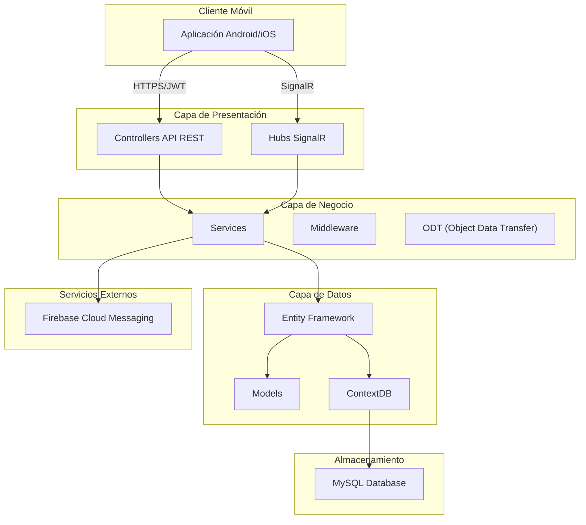
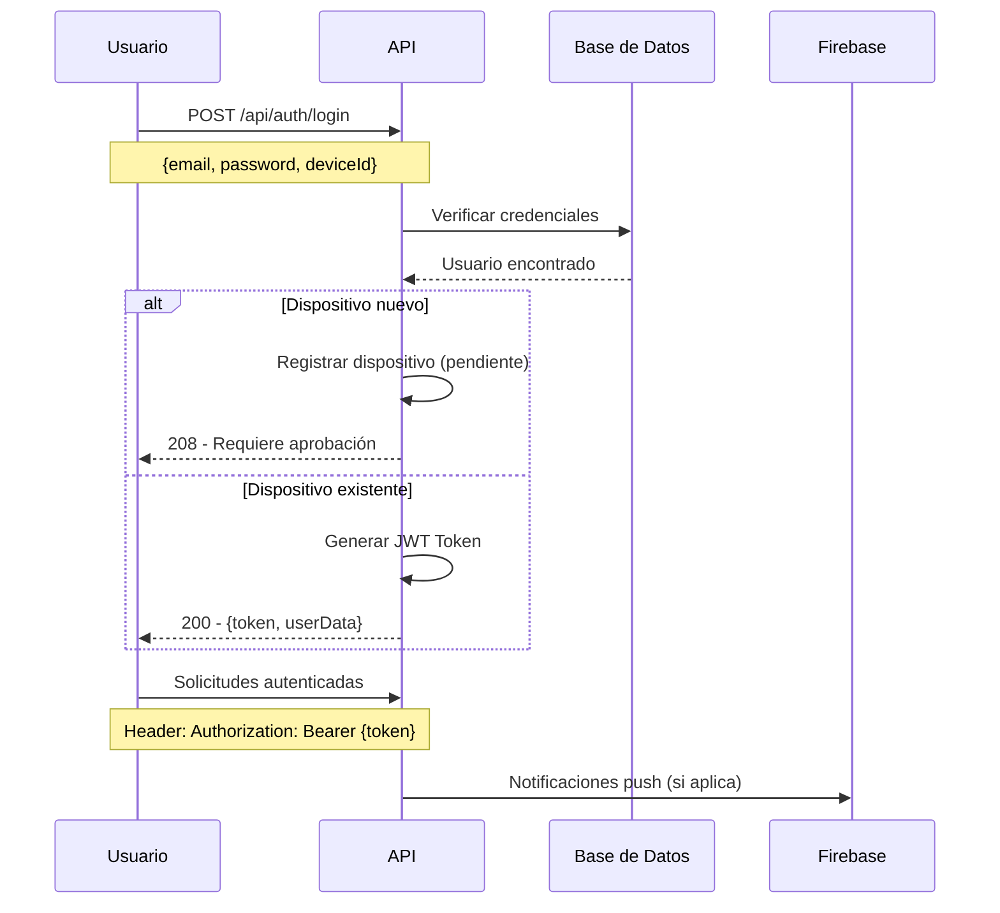
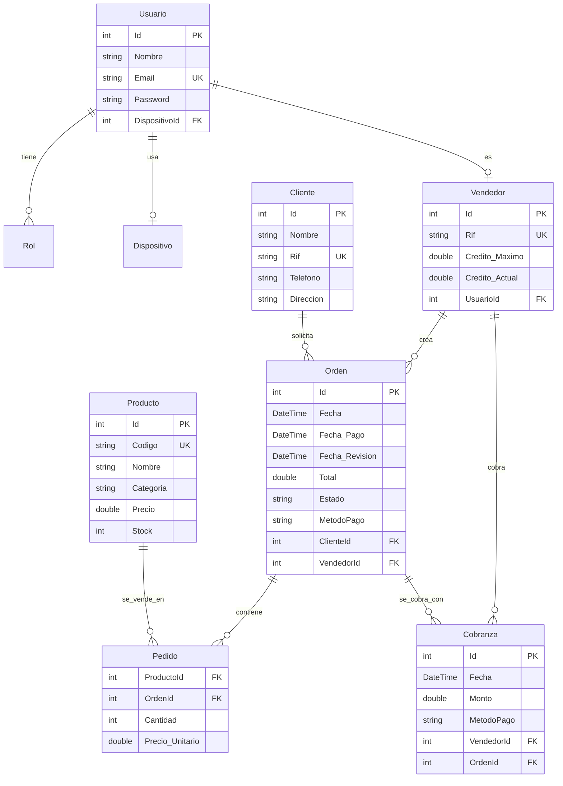
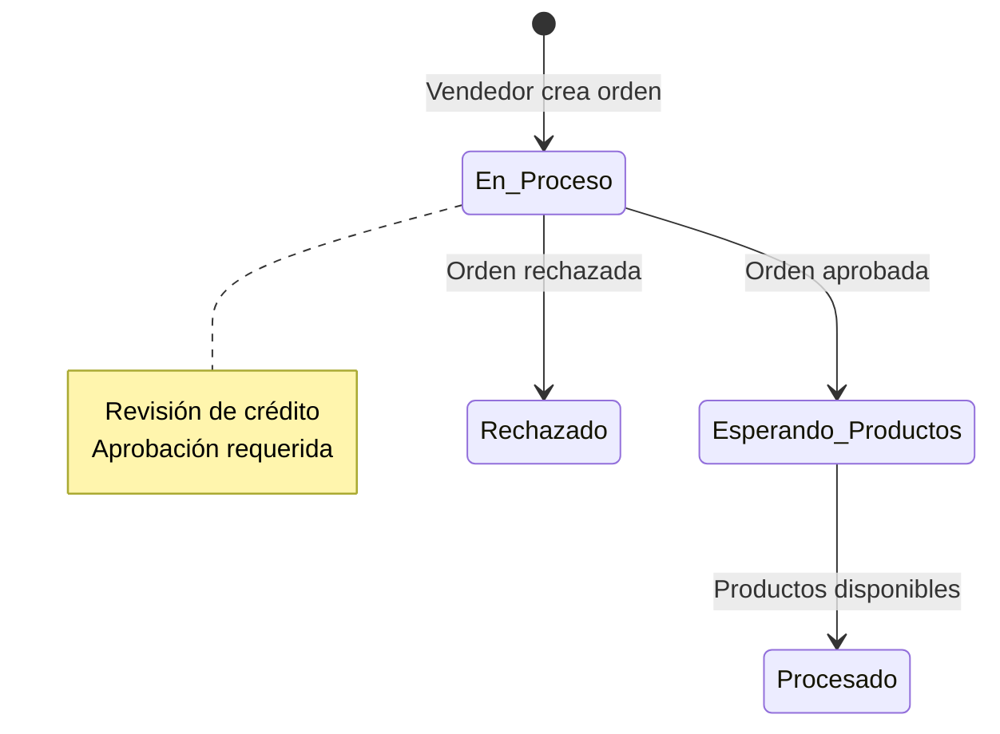
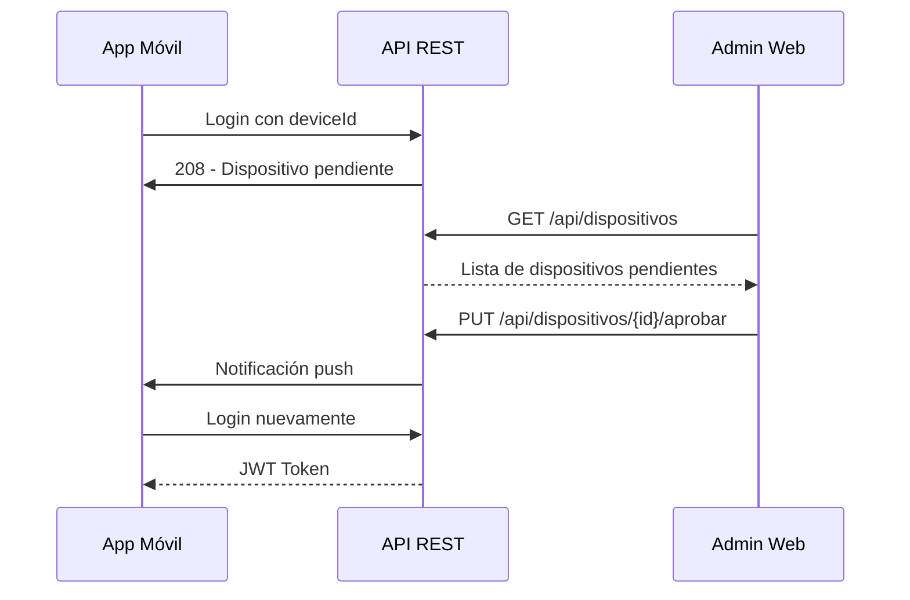

# WebApi_IGBC - Sistema de Gestión Comercial

## 📋 Descripción General

WebApi_IGBC es una API RESTful desarrollada en ASP.NET Core 8.0 que gestiona un sistema completo de administración comercial orientado a la venta de productos. El sistema permite la gestión de vendedores, clientes, órdenes de pedido, productos, cobranzas y notificaciones en tiempo real, con integración móvil a través de Firebase Cloud Messaging.

### 🎯 Propósito Principal

Esta API sirve como backend para aplicaciones móviles de ventas, proporcionando:

- Gestión completa del ciclo de ventas (clientes → órdenes → productos → cobranzas)
- Sistema de autenticación segura con JWT
- Control de crédito para vendedores
- Notificaciones push en tiempo real
- Administración de dispositivos móviles
- Sistema de aprobación de órdenes

## 🏗️ Arquitectura y Tecnología

### Stack Tecnológico

| Tecnología | Versión | Propósito |
|------------|---------|-----------|
| **ASP.NET Core** | 8.0 | Framework de desarrollo |
| **Entity Framework Core** | 9.0.9 | ORM y acceso a datos |
| **MySQL** | 10.4.32+ | Base de datos relacional |
| **Pomelo.EntityFrameworkCore** | 9.0.0 | Driver MySQL para EF |
| **JWT Bearer** | 8.0.20 | Autenticación y autorización |
| **Firebase Admin** | 3.4.0 | Notificaciones push |
| **SignalR** | - | Comunicación en tiempo real |
| **BCrypt.Net** | 4.0.3 | Hashing de contraseñas |
| **Swagger** | 6.6.2 | Documentación de API |

### Arquitectura de la Aplicación



## 🔐 Sistema de Autenticación y Autorización

### Roles del Sistema

El sistema implementa tres roles principales:

1. **Vendedor** (`Vendedor`)
   - Crea y gestiona sus propias órdenes
   - Visualiza sus clientes asignados
   - Consulta su historial de ventas

2. **Aprobador** (`Aprobador`)
   - Aprueba/rechaza órdenes pendientes
   - Gestiona dispositivos móviles
   - Acceso a reportes administrativos

3. **Administrador** (`Admin`)
   - Control total del sistema
   - Gestión de usuarios y roles
   - Configuración del sistema

### Flujo de Autenticación



## 📊 Estructura de Base de Datos

### Diagrama de Entidades



## 🚀 Endpoints de la API

### Autenticación

| Método | Endpoint | Descripción | Body | Respuesta |
|--------|----------|-------------|------|-----------|
| `POST` | `/api/auth/login` | Iniciar sesión | `{email, password, deviceId}` | `{id, name, email, roles[], token}` |

### Gestión de Usuarios

| Método | Endpoint | Descripción | Autenticación |
|--------|----------|-------------|----------------|
| `GET` | `/api/usuario` | Obtener todos los usuarios | Admin |
| `GET` | `/api/usuario/{id}` | Obtener usuario por ID | Admin |
| `POST` | `/api/usuario` | Crear nuevo usuario | Admin |
| `PUT` | `/api/usuario/{id}` | Actualizar usuario | Admin |
| `DELETE` | `/api/usuario/{id}` | Eliminar usuario | Admin |

### Gestión de Vendedores

| Método | Endpoint | Descripción | Autenticación |
|--------|----------|-------------|----------------|
| `GET` | `/api/vendedors` | Listar todos los vendedores | Admin |
| `GET` | `/api/vendedors/{id}` | Obtener vendedor específico | Admin |
| `POST` | `/api/vendedors` | Crear nuevo vendedor | Admin |
| `PUT` | `/api/vendedors/{id}` | Actualizar vendedor | Admin |

### Gestión de Clientes

| Método | Endpoint | Descripción | Autenticación |
|--------|----------|-------------|----------------|
| `GET` | `/api/clientes` | Listar clientes | Vendedor+ |
| `GET` | `/api/clientes/{id}` | Obtener cliente específico | Vendedor+ |
| `POST` | `/api/clientes` | Crear cliente | Vendedor+ |
| `PUT` | `/api/clientes/{id}` | Actualizar cliente | Vendedor+ |

### Gestión de Órdenes

| Método | Endpoint | Descripción | Autenticación |
|--------|----------|-------------|----------------|
| `GET` | `/api/ordenes` | Listar todas las órdenes | Aprobador+ |
| `GET` | `/api/ordenes/usuario` | Órdenes del usuario autenticado | Vendedor |
| `GET` | `/api/ordenes/{id}` | Obtener orden específica | Vendedor+ |
| `POST` | `/api/ordenes` | Crear nueva orden | Vendedor |
| `PUT` | `/api/ordenes/{id}` | Actualizar orden | Vendedor |
| `DELETE` | `/api/ordenes/{id}` | Eliminar orden | Admin |

### Gestión de Productos

| Método | Endpoint | Descripción | Autenticación |
|--------|----------|-------------|----------------|
| `GET` | `/api/productos` | Listar productos | Vendedor+ |
| `GET` | `/api/productos/{id}` | Obtener producto específico | Vendedor+ |
| `POST` | `/api/productos` | Crear producto | Admin |
| `PUT` | `/api/productos/{id}` | Actualizar producto | Admin |
| `DELETE` | `/api/productos/{id}` | Eliminar producto | Admin |

### Gestión de Cobranzas

| Método | Endpoint | Descripción | Autenticación |
|--------|----------|-------------|----------------|
| `GET` | `/api/cobranzas` | Listar cobranzas | Aprobador+ |
| `POST` | `/api/cobranzas` | Registrar cobranza | Vendedor |

### Aprobación de Órdenes

| Método | Endpoint | Descripción | Autenticación |
|--------|----------|-------------|----------------|
| `GET` | `/api/aprobador` | Órdenes pendientes de aprobación | Aprobador |
| `PUT` | `/api/aprobador/{id}` | Aprobar/rechazar orden | Aprobador |

### Notificaciones

| Método | Endpoint | Descripción | Autenticación |
|--------|----------|-------------|----------------|
| `Hub` | `/notificacionesHub` | Conexión SignalR | JWT |

## 💼 Lógica de Negocio

### Flujo de Órdenes



### Control de Crédito

- **Crédito Máximo**: Límite establecido por administrador
- **Crédito Actual**: Monto actualmente utilizado
- **Validación**: Al crear orden, se verifica `Crédito_Actual + Total_Orden <= Crédito_Máximo`
- **Actualización**: Al aprobar/rechazar órdenes, se ajusta el crédito actual

### Estados de Órdenes

- `En Proceso` - Orden creada, pendiente de aprobación
- `Esperando Productos` - Aprobada, esperando disponibilidad
- `Procesado` - Completada exitosamente
- `Rechazado` - Rechazada por aprobador

## 🔧 Instalación y Configuración

### Requisitos Previos

- [.NET 8.0 SDK](https://dotnet.microsoft.com/download/dotnet/8.0)
- [MySQL Server](https://dev.mysql.com/downloads/) 8.0+
- [Visual Studio 2022](https://visualstudio.microsoft.com/) o [VS Code](https://code.visualstudio.com/)

### Pasos de Instalación

1. **Clonar el repositorio**

   ```bash
   git clone https://github.com/tu-usuario/WebApi_IGBC.git
   cd WebApi_IGBC
   ```

2. **Configurar la base de datos**

   ```sql
   CREATE DATABASE IGBC_Server;
   CREATE USER 'root'@'localhost' IDENTIFIED BY 'tu_password';
   GRANT ALL PRIVILEGES ON IGBC_Server.* TO 'root'@'localhost';
   FLUSH PRIVILEGES;
   ```

3. **Configurar las variables de entorno**
   - Copiar `appsettings.json` a `appsettings.Development.json`
   - Actualizar la cadena de conexión MySQL
   - Configurar clave JWT y credenciales Firebase

4. **Instalar dependencias**

   ```bash
   dotnet restore
   ```

5. **Aplicar migraciones**

   ```bash
   dotnet ef database update
   ```

6. **Ejecutar la aplicación**

   ```bash
   dotnet run
   ```

### Configuración de Firebase

1. Crear proyecto en [Firebase Console](https://console.firebase.google.com/)
2. Generar archivo de credenciales de servicio
3. Guardar como `firebase_key.json` en la raíz del proyecto
4. Configurar canales de notificación en la app móvil

## 🧪 Desarrollo y Testing

### Variables de Configuración

```json
{
  "Logging": {
    "LogLevel": {
      "Default": "Information",
      "Microsoft.AspNetCore": "Warning"
    }
  },
  "AllowedHosts": "*",
  "ConnectionStrings": {
    "Connection": "server=localhost;port=3306;database=IGBC_Server;user=root;password=tu_password"
  },
  "JWT": {
    "Key": "clave_secreta_super_segura_minimo_256_bits",
    "Issuer": "https://tu-api.com",
    "Audience": "https://tu-app-movil.com"
  }
}
```

### Entorno de Desarrollo

En desarrollo, la aplicación incluye:

- Swagger UI en `/swagger`
- Datos de prueba generados automáticamente
- Logs detallados de Entity Framework
- Validaciones de seguridad relajadas

### Testing de API con Swagger

1. Acceder a `https://localhost:5001/swagger`
2. Autenticar con usuario de prueba:
   - **Admin**: `PruebaAdm@gmail.com` / `12345678`
   - **Aprobador**: `PruebaApro@gmail.com` / `12345678`
   - **Vendedor**: `PruebaVen1@gmail.com` / `12345678`

## 📱 Integración Móvil

### Flujo de Dispositivos



### Notificaciones Push

El sistema utiliza Firebase Cloud Messaging para:

- **Aprobación de dispositivos**: Cuando un admin aprueba un dispositivo
- **Actualización de órdenes**: Cuando el estado de una orden cambia
- **Recordatorios**: Alertas de pagos pendientes
- **Anuncios**: Comunicaciones generales

Configuración Android:

```xml
<!-- AndroidManifest.xml -->
<application>
    <service
        android:name=".MyFirebaseMessagingService"
        android:exported="false">
        <intent-filter>
            <action android:name="com.google.firebase.MESSAGING_EVENT" />
        </intent-filter>
    </service>
</application>
```

## 🔒 Seguridad

### Medidas Implementadas

- **JWT Tokens**: Autenticación stateless con expiración
- **BCrypt**: Hashing de contraseñas con salt único
- **Rate Limiting**: Prevención de ataques de fuerza bruta
- **Validación de entrada**: Prevención de SQL injection
- **HTTPS**: Cifrado de comunicaciones
- **Dispositivos registrados**: Control de acceso por dispositivo

### Validaciones

```csharp
// Email validation
Regex.IsMatch(email, @"^[a-zA-Z0-9_+-]+@[a-zA-Z0-9]+[.][a-zA-Z]{2,}$")

// RIF validation (Venezuela)
Regex.IsMatch(rif, @"^[V|E|J|P]-[0-9]{5,9}$")

// Password requirements
MinLength: 3, MaxLength: 16
```

## 🚀 Despliegue en Producción

### Consideraciones

1. **Seguridad**
   - Usar HTTPS obligatorio
   - Configurar firewall de aplicaciones
   - Implementar rate limiting
   - Habilitar logging y monitoreo

2. **Base de datos**
   - Respaldos automáticos
   - Índices optimizados
   - Configuración de conexiones

3. **Performance**
   - Caching con Redis (recomendado)
   - CDN para archivos estáticos
   - Load balancing si es necesario

4. **Monitoreo**
   - Application Insights o similar
   - Alertas de errores
   - Métricas de rendimiento

### Docker (Opcional)

```dockerfile
FROM mcr.microsoft.com/dotnet/aspnet:8.0 AS base
WORKDIR /app
EXPOSE 80
EXPOSE 443

FROM mcr.microsoft.com/dotnet/sdk:8.0 AS build
WORKDIR /src
COPY ["WebApi_IGBC.csproj", "."]
RUN dotnet restore "./WebApi_IGBC.csproj"
COPY . .
WORKDIR "/src/."
RUN dotnet build "WebApi_IGBC.csproj" -c Release -o /app/build

FROM build AS publish
RUN dotnet publish "WebApi_IGBC.csproj" -c Release -o /app/publish

FROM base AS final
WORKDIR /app
COPY --from=publish /app/publish .
ENTRYPOINT ["dotnet", "WebApi_IGBC.dll"]
```

## 📚 Documentación Adicional

### Estructura de Proyecto

```
WebApi_IGBC/
├── Controllers/           # Controladores API REST
├── Models/               # Entidades de base de datos
├── ODT/                  # Object Data Transfer classes
├── ContextDB/            # Configuración de Entity Framework
├── Services/             # Servicios de negocio
├── Hubs/                 # SignalR Hubs
├── Middleware/           # Middleware personalizado
├── Definiciones/         # Constantes y enums
├── Utils/                # Utilidades y helpers
├── Migrations/           # Migraciones de base de datos
├── wwwroot/              # Archivos estáticos
└── Properties/           # Configuración de lanzamiento
```

### Convenciones de Código

- **Nomenclatura**: C# standard (PascalCase para clases, camelCase para variables)
- **Async/Await**: Usado consistentemente para operaciones de I/O
- **Validation**: Data annotations y validación personalizada
- **Error Handling**: Try-catch con respuestas HTTP apropiadas
- **Logging**: Integración con sistema de logging de ASP.NET Core

### Ejemplos de Uso

#### Autenticación

```csharp
// POST /api/auth/login
{
    "correo": "vendedor@empresa.com",
    "password": "contraseña123",
    "deviceId": "android_device_123456",
    "info_Telefono": "Samsung Galaxy S21"
}
```

#### Crear Orden

```csharp
// POST /api/ordenes
// Headers: Authorization: Bearer {token}
{
    "Id_Vendedor": 123,
    "Rif_Cliente": "J-12345678",
    "ClienteNombre": "Empresa XYZ",
    "Total": 1500.00,
    "MetodoPago": "Credito"
}
```

#### Actualizar Orden

```csharp
// PUT /api/ordenes/456
// Headers: Authorization: Bearer {token}
{
    "Id": 456,
    "Vendedor_id": 123,
    "Total": 1800.00,
    "MetodoPago": "Contado"
}
```

---

**Desarrollado con ❤️ por el Equipo Tecnico**
